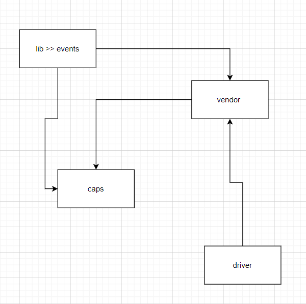

# LAB: Event Driven Applications / CAPS / Branch ***events***

CAPS Phase 1: Begin the build of an application for a product called CAPS - The Code Academy Parcel Service.

------------------------

### **Phase 1 Requirements**

Today, we begin the first of a 4-Phase build of the CAPS system, written in Node.js. In this first phase, our goal is to setup a 
pool of events and handler functions, with the intent being to refactor parts of the system throughout the week, but keep the 
handlers themselves largely the same. The task of “delivering a package” doesn’t change (the handler), even if the mechanism for 
triggering that task (the event) does.

#### ***The following user/developer stories detail the major functionality for this phase of the project.***

- As a vendor, I want to alert the system when I have a package to be picked up.
- As a driver, I want to be notified when there is a package to be delivered.
- As a driver, I want to alert the system when I have picked up a package and it is in transit.
- As a driver, I want to alert the system when a package has been delivered.
- As a vendor, I want to be notified when my package has been delivered.

#### ***And as developers, here are some of the development stories that are relevant to the above.***

- As a developer, I want to use industry standards for managing the state of each package.
- As a developer, I want to create an event driven system so that I can write code that happens in response to events, in real time.

---------------------

### in this Applications events we have 

1- Vendor Client Application 

- we have in vendor.js file  should use a store name as a parameter. 
- When triggered, the ve ndor module simulates a pickup event for the given store name to the Global Event Pool: -  
  - emits pickup to the global event pool.
  - sends a vendor order payload.

- Listens for a delivered event and responds by logging a message to the console:

  - Thank you, <'customer-name'>  

2- Driver Client Application

- Listens for a pickup event from the Global Event Pool and responds with the following:

  - Log a message to the console: DRIVER: picked up <'ORDER_ID'>.

  - Emit an ‘in-transit’ event to the Global Event Pool with the order payload.

  - Log a confirmation message to the console: DRIVER: delievered <'ORDER_ID'>.

  - Emit a ‘delivered` event to the Global Event Pool with the order payload.

-----------------

### UML 

Create a UML diagram of the CAPS system on a whiteboard before you start.

---------------------------------

### links 

[pull link](https://github.com/leenahmad/caps/pull/2)

[action link](https://github.com/leenahmad/caps/actions)

